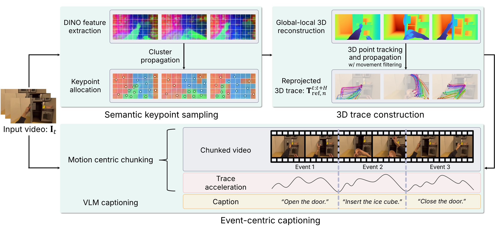

<h1 align="center">μ₀: A Scalable 3D Interaction-Trace World Model</h1>

<h3 align="center">CoRL 2026</h3>

<p align="center">
  🌐 <a href="https://mu0-wm.github.io">Project Page</a> ·
  📄 <a href="https://arxiv.org/abs/2606.13769">Paper</a> ·
  🤗 <a href="https://huggingface.co/collections/furonghuang-lab/mu0">Models</a> ·
  🧠 <a href="https://github.com/Yoonkyo/mu0">μ₀ code</a>
</p>

<p align="center">
  <a href="https://sjlee.cc/">Seungjae Lee</a><sup>1*</sup>,
  <a href="https://yoonkyojung.com/">Yoonkyo Jung</a><sup>1*</sup>,
  <a href="https://ju-suk.github.io/">Jusuk Lee</a><sup>2</sup>,
  <a href="https://jhshin00.github.io/">Jonghun Shin</a><sup>2</sup>,
  <a href="https://amirshahid.github.io/">Amir Hossein Shahidzadeh</a><sup>1</sup>,<br>
  <a href="https://yaochih.github.io/">Yao-Chih Lee</a><sup>1</sup>,
  <a href="https://scholar.google.co.kr/citations?user=TLQUwIMAAAAJ&hl=en">H. Jin Kim</a><sup>2</sup>,
  <a href="https://jbhuang0604.github.io/">Jia-Bin Huang</a><sup>1†</sup>,
  <a href="https://furong-huang.com/">Furong Huang</a><sup>1†</sup><br>
  <sub><sup>*</sup>Equal contribution &nbsp;&nbsp; <sup>†</sup>Equal advising</sub><br>
  <sub><sup>1</sup>University of Maryland, College Park &nbsp;·&nbsp; <sup>2</sup>Seoul National University</sub>
</p>

<p align="center">
  
</p>

---

**TraceExtract** is the data-processing stage of [**μ₀**](https://mu0-wm.github.io),
a scalable 3D interaction-trace world model. It converts cross-embodiment videos
and robot datasets into **3D interaction-trace episodes** — the training data μ₀
learns from. For each source video it estimates per-frame depth and camera pose,
tracks semantic interaction points through 3D, compensates for camera motion, and
retargets trajectories by arc length, producing consistent embodiment-agnostic
traces. Because these traces are independent of the recording embodiment, μ₀ can
be pretrained from video alone and transferred across robots.

The episodes produced here are consumed directly by the μ₀ training pipeline —
see [μ₀ `docs/release/TRAINING.md`](https://github.com/Yoonkyo/mu0/blob/main/docs/release/TRAINING.md)
§2 for training on your own TraceExtract episodes. The μ₀ evaluation set on the
Hugging Face Hub ([`furonghuang-lab/mu0`](https://huggingface.co/furonghuang-lab/mu0),
`test_set.tar`) is itself in TraceExtract output format, so it doubles as a
reference for what this pipeline produces.

## Pipeline in one paragraph

From a raw video (or a robot-dataset episode) TraceExtract runs: **(1) metric
depth + camera pose** via VGGT/SpatialTrackerV2 over a hybrid chunked pass that
keeps globally consistent poses on arbitrarily long videos; **(2) 3D point
tracking** via TAPIP3D; **(3) semantic keypoint proposal** by clustering DINOv2
patch features into interaction entities (objects, tools, hands, contact
regions); and **(4) camera-motion compensation + arc-length speed retargeting**
so trajectories live in a stable, speed-normalized 3D space. The result is one
directory per episode holding the RGB frames, metric depth, camera parameters,
and a `samples/` bundle of keypoints with their future 3D trajectories, plus the
language instruction in `description.txt` when the source dataset provides one.

See [`docs/long_video_pipeline.md`](docs/long_video_pipeline.md) for the full
technical description of the long-video chunked pipeline.

## Installation

### 1. Environment
A dedicated conda environment is recommended, since `setup_env.sh` pins
PyTorch 2.8.0 (CUDA 12.8) and builds the `pointops2` CUDA extension, which
needs a CUDA 12.8 toolkit (`nvcc`) on the build machine:
```bash
git clone https://github.com/Yoonkyo/TraceExtract.git
cd TraceExtract
conda create -n traceextract python=3.11 -y
conda activate traceextract
```
You can instead reuse an existing environment (e.g. your μ₀ env) if it already
has a compatible PyTorch / CUDA build — in that case comment out the PyTorch
install line in `setup_env.sh` so it is not overwritten, and run the rest.

### 2. Install dependencies
Installs PyTorch 2.8.0 (CUDA 12.8), builds the `pointops2` CUDA extension, and
installs everything needed for depth/pose estimation, 3D tracking, DINO-based
keypoint extraction, the dataset loaders, and the optional caption step.
```bash
bash setup_env.sh
```
Video files are decoded with `ffmpeg`; `setup_env.sh` installs it from conda-forge
if it is not already on your `PATH`. The `pointops2` extension is compiled for all
GPU generations that PyTorch 2.8 supports, so one environment works across GPU
types; to build only for your GPU (faster), e.g. `export TORCH_CUDA_ARCH_LIST="8.6"`
before running the script.

### 3. Download checkpoints
Only the TAPIP3D tracker checkpoint must be downloaded manually; the other
weights (VGGT4Track from Hugging Face; DINOv2 and CoTracker3 via `torch.hub`)
are fetched automatically on first run, so that run needs internet access. See
[`checkpoints/DOWNLOAD.md`](checkpoints/DOWNLOAD.md).
```bash
mkdir -p checkpoints
wget -O checkpoints/tapip3d_final.pth \
  https://huggingface.co/zbww/tapip3d/resolve/main/tapip3d_final.pth
```

## Processing datasets

Every dataset is processed with one launcher, `run_traceextract.sh`, which
applies a per-dataset preset (frame rate, resolution, chunk sizes) and calls
`infer.py`. Each episode becomes one output directory (see
[Output structure](#output-structure)).

```bash
./run_traceextract.sh <dataset> <input_root> <out_dir> [extra infer.py args...]
```

| `<dataset>` | Expected raw layout under `<input_root>` | Preset |
|-------------|------------------------------------------|--------|
| `agibot`   | `<task_id>/<episode_id>/{obs.mp4, task.txt}` | 5 fps |
| `droid`    | RLDS TFRecords: `[1.0.1/]{dataset_info.json, droid_101-train.tfrecord-*}` | every 3rd frame (15 → 5 Hz) |
| `egodex`   | `part*/<task>/<id>.mp4` + `<id>.hdf5` sidecar | 10 fps, resized to 360×640, 144 points per entity |
| `egoverse` | `<episode>/{zarr.json, images.front_1/}` (Zarr v3) | 10 fps |
| `video`    | your own videos or frame folders (see [below](#your-own-videos)) | 10 fps (videos) / every 3rd frame (frame folders) |

All presets add `--skip_existing --chunk_size 60 --tracking_chunk_size 360 --sparse_max 60`,
which bounds GPU memory regardless of video length (we measured a peak of ≈20 GB
on a 48 GB GPU for a 361-frame 360×640 video). Extra arguments are passed through to `infer.py` after the preset,
so options that take a value override it:

```bash
# DROID: first shard only, wrist camera
./run_traceextract.sh droid /data/droid outputs/droid --droid_num_shards 1 --droid_camera wrist_image_left

# EgoDex: try a single episode first
./run_traceextract.sh egodex /data/egodex outputs/egodex --max_episodes 1

# Only process the episodes named in a list (one output-directory name per line)
./run_traceextract.sh agibot /data/agibot outputs/agibot --episode_list my_episodes.txt
```

For `agibot`, `droid`, and `egodex`, the episode's language instruction(s) are
written to `description.txt` and the source annotation to `meta.json`.

Optional environment variables for long unattended runs:
`MAX_RETRIES=N` relaunches `infer.py` when it exits with an error (it exits 1 if any
episode failed, or it was killed, e.g. out of memory) and resumes where it stopped;
`MIN_FREE_VRAM_MIB=N` waits for that much free GPU memory before each attempt. Several workers (e.g. SLURM array tasks) can share one `<out_dir>`:
`--skip_existing` also takes a per-episode lock so no two workers process the same
episode. Episodes rejected for low track coverage are remembered (a hidden
`.low_coverage_<episode>` file in `<out_dir>`) and not retried unless you lower
`--min_track_coverage` or delete that file.

To add a new dataset, implement the four hooks described in
[`datasets/registry.py`](datasets/registry.py) and register them there.

### Your own videos

For videos not covered by a dataset loader, use `video` (this runs `infer.py --batch_process`):
```bash
./run_traceextract.sh video <input_directory> outputs/custom --scan_depth 0
```
- **Case A** — video files directly in the folder (`1.webm`, `2.mp4`, …): use `--scan_depth 0`.
- **Case B** — one subfolder per video containing extracted `.jpg`/`.png` frames: use `--scan_depth 1` (the `video` preset's default).

### Key options

| Argument | Description | Default |
|----------|-------------|---------|
| `--frame_step` | Take every Nth frame (frame folders, DROID, or video when `--target_fps 0`) | `1` |
| `--target_fps` | Subsample video inputs to ~this fps (`0` = use `--frame_step`) | `10.0` |
| `--target_hw H W` | Resize frames before processing (all outputs inherit this resolution) | — |
| `--chunk_size` | Max frames per VGGT dense chunk; longer videos are processed chunk by chunk | `60` |
| `--tracking_chunk_size` | Max frames per tracking chunk | `chunk_size` |
| `--sparse_max` | Max frames for the global sparse VGGT pass (auto-clamped to `chunk_size`) | `150` |
| `--future_len` / `--history_len` | Future / history trajectory length saved per keypoint | `128` / `32` |
| `--min_track_coverage` | Skip episodes whose mean track coverage is below this (e.g. heavy camera rotation) | `0.6` |
| `--skip_existing` | Skip episodes whose output already exists | `False` |
| `--max_episodes` | Process at most N episodes (handy for a dry run) | — |
| `--debug` | Save a debug MP4 overlay of tracked points | `False` |

Run `python infer.py --help` for the full list.

The chunked long-video pipeline keeps VRAM bounded by holding only one model
(VGGT / TAPIP3D / DINO) on the GPU at a time.

## Output structure
```
<out_dir>/
└── <episode_name>/
    ├── images.npy              # (T, H, W, 3) uint8 — RGB frames
    ├── depth.npy               # (T, H, W) float16 — metric depth (m)
    ├── cameras.npz             # per-frame intrinsics + extrinsics
    ├── acceleration.npz        # per-frame acceleration
    ├── movement_statistics.npz # keypoint displacement stats
    ├── description.txt         # language instruction(s) (agibot / droid / egodex)
    ├── meta.json               # source-dataset metadata (agibot / droid / egodex)
    └── samples/
        ├── frame_indices.npy   # (F,)   which frames have sample data
        ├── offsets.npy         # (F+1,) row boundaries into the arrays below
        ├── keypoints.npy       # (N_total, 2)             float16
        ├── traj.npy            # (N_total, future_len, 3)  float16 — future, arc-length retargeted
        ├── traj_history.npy    # (N_total, history_len, 3) float16 — history, arc-length retargeted
        ├── valid_steps.npy     # (N_total, future_len)     bool
        ├── valid_steps_history.npy
        └── ...                 # cluster_ids, is_moving, visibs, raw_traj*, raw_valid_steps*
```

Per-frame sample data is accessed via offset-based slicing:
```python
frame_indices = np.load("samples/frame_indices.npy")   # (F,)
offsets       = np.load("samples/offsets.npy")          # (F+1,)
slot   = np.where(frame_indices == t)[0][0]
lo, hi = int(offsets[slot]), int(offsets[slot + 1])
keypoints = np.load("samples/keypoints.npy", mmap_mode="r")[lo:hi]  # (N_t, 2)
traj      = np.load("samples/traj.npy",      mmap_mode="r")[lo:hi]  # (N_t, future_len, 3)
```
All `.npy` files support `mmap_mode="r"`. See
[`docs/output_structure.md`](docs/output_structure.md) for the full schema and
dataloader tips. The optional [caption step](#optional-caption-generation) adds
`curated_training_texts.json`, the language annotations μ₀ training reads.

## (Optional) Caption Generation

Turn the extracted trajectories into per-chunk and window-level natural-language
motion captions for downstream training (written to `curated_training_texts.json`
in each episode directory). This step splits each episode into
motion chunks, captions them with a multimodal model (OpenAI / Gemini), and
merges adjacent captions into longer window-level descriptions. See
[`caption/README.md`](caption/README.md) for setup and usage.

```bash
pip install python-dotenv openai google-genai      # caption deps (already installed by setup_env.sh)
cp caption/.env.example caption/.env               # then add your API key(s)
python caption/curate_captions.py --root outputs/droid
```

## Visualization & verification

### 3D trajectory viewer
Inspect the extracted 3D traces on a single frame with [viser](https://github.com/nerfstudio-project/viser):

```bash
python visualize_single_image.py \
    --video_dir <out_dir>/<episode_name> \
    --frame_index 0 \
    --port 8080
```
- Add `--visualize_history` to show past (history) trajectories instead of future ones.
- Add `--raw` to show frame-aligned trajectories (pre-retarget) instead of the arc-length retargeted ones.

**Remote server:** forward the port from your local machine before opening the browser:
```bash
# Run on your LOCAL machine
ssh -L 8080:localhost:8080 <user>@<remote-host>
# Then run the viewer in that SSH session and open http://localhost:8080
```

### Verify output files
```bash
python checker/batch_process_result_checker_3d.py <out_dir> --max-videos 1 --max-samples 3
# add --visualize_history to check history trajectories instead of future
```

## Training μ₀ on these episodes

TraceExtract only produces trace episodes; training and evaluation of the μ₀
world model live in the main [μ₀ repository](https://github.com/Yoonkyo/mu0).
Point the μ₀ training pipeline at your `<out_dir>` — see
[μ₀ `docs/release/TRAINING.md`](https://github.com/Yoonkyo/mu0/blob/main/docs/release/TRAINING.md) §2.

## Citation

```bibtex
@article{lee2026mu0,
  title={$\mu_0$: A Scalable 3D Interaction-Trace World Model},
  author={Lee, Seungjae and Jung, Yoonkyo and Lee, Jusuk and Shin, Jonghun and
          Shahidzadeh, Amir Hossein and Lee, Yao-Chih and Kim, H. Jin and
          Huang, Jia-Bin and Huang, Furong},
  journal={arXiv preprint arXiv:2606.13769},
  year={2026}
}
```

## Acknowledgements

TraceExtract builds on several open-source models and tools:
**[SpatialTrackerV2](https://github.com/henry123-boy/SpaTrackerV2) / VGGT**
(depth + camera pose), **[TAPIP3D](https://github.com/zbw001/TAPIP3D)** (3D point
tracking), **[MoGe](https://github.com/microsoft/MoGe)** (metric geometry),
**[DINOv2](https://github.com/facebookresearch/dinov2)** (semantic features),
and **[CoTracker](https://github.com/facebookresearch/co-tracker)**. We thank
these teams and contributors. Code vendored from these projects under
`models/` and `third_party/` remains under its original upstream license (see
the headers of those files).
